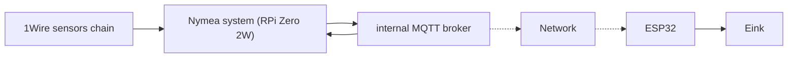

# Readme
Project of E-ink display showing all the informations from the heating system (temperatures of heater, heat buffer, solar panel states, power, pressure in the installation etc). written in Micropython, based on ESP32 MCU and Raspberry Pi
 
Very alpha phase, GUI is still just as it is, however there are milestones achieved so far:
- resilient to MQTT broker disconnection, network fails etc. - thanks to mqtt_as.py library
- it can even do screenshots of the GUI and save them as .bmp or .qoi files
- shows needed information without need to check Android app or going to boiler room personally
- remote monitoring - I can assess that something is going wrong, it will be developed into alarm system which can be displayed on the screen

# How to install and configure
**System is tailored to specific setup, hovewer there is instruction how to setup such system in general:**
1) Install Nymea system via Rapsberry Pi Imager (Operation System -> Other specific-purpose OS -> Home assistants and home automation -> nymea:core image)
2) Do initial setup through nymea-app (PC or on Android device)
3) In nymea:app system settings, tab Plugins, search and install internal-mqtt-client and One-wire plugins
4) Connect One-Wire sensor chain to GPIO4 of Raspberry Pi and then in nymea:app -> Configure Things tab add each sensor (they are discovered separetaly, each one has to be added individually, but it is done once)
5) For MQTT based devices there has to be one MQTT client for each device - setup is very simple - Configure Things -> Add -> Internal MQTT Client -> Subscription topic filter
6) For init setup that's all - if we want to access sensors values, proccess them, send via MQTT somewhere else, we need to write custom script in "Magic" tab

**The specific part:**
1) Every system is different, I wrote a script wchich calculates increase or decrease of power basing on temperature changes, time and specific heat of water, packs it into one MQTT message and then sends to network
8) This packet is received by ESP32, which proccess the data and then displays them on E-Ink screen

**ESP32 installation:**
1) Firstly flash ESP32 board with Micropython v1.21.0 from here: https://micropython.org/download/ESP32_GENERIC/ - link also contains info how to install it, however easiest way is to flash it with Thonny IDE 
2) After Micropython setup, upload all ESP32_eink/ folder content from this repo (maybe except screenshots) using Thonny or mpremote (more advanced)
3) Rename secrets_etc_template.py to secrets_etc.py and provide WiFi credenstials and MQTT broker's IP
4) Connect this display https://www.waveshare.com/pico-epaper-4.2-b.htm via SPI interface

 
# Demo and preview

Here is progress in GUI development:

And how physical screen looks like:

# System flow (simplified):

# History:

The main problem after upgrading boiler room to 900l water buffer tank and wood boiler was - how to assess how much energy is stored? One termometer was not enough, because it can be very on the top (eg. 80°C) and cold in the middle (30-40°C). 
So I came up with idea I will attach nine DS18B20 sensors directly on the tank with magnets:

and from using Arduino to read these values it transformed to this project;)

