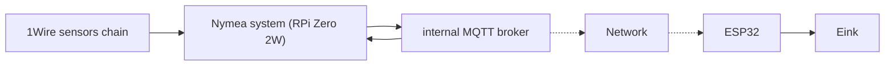

Project of E-ink display showing all the informations from the heating system (temperatures, solar panel states etc). 
It is based on Raspberry Pi Zero 2W with Nymea system installed, Nymea system gathers all sensors data and send them via MQTT - ESP32 board gets that data and shows them on the e-ink display.

ESP32 board is flashed with MicroPython v1.21.0 from 2023-10-05, newer version have issue with Wi-fi during startup 

Very alpha phase, but something is working ;) It can even do screenshots of GUI and save them as .bmp or .qoi files

Here is progress in GUI development:

And how screen looks like:

Project consist of couple of elements:
 - ESP32_DWINLCD - first HMI was based on DWIN 7" LCD with touch, driven by ESP32, for now abandoned as I focused on e-ink screen
 - ESP32_eink - currently developed - I am using this screen: https://www.waveshare.com/pico-epaper-4.2-b.htm - red, black and white - picture clarity is very good, but it lacks proper partial refresh and refresh time is very long (15s), but it is ok for displaying temperatures etc.

Ideas to develop:
- wheather display
- getting state of solar panels driver to properly calculate solar power
- measuring temperatures of heating itself
- water pressure sensor in heating installation and also solar system - for fault/leak detection
  

History:

The main problem after upgrading boiler room to 900l water buffer tank and wood boiler was - how to assess how much energy is stored? One termometer was not enough, because it can be very on the top (eg. 80°C) and cold in the middle (30-40°C). 
So I came up with idea I will attach nine DS18B20 sensors directly on the tank with magnets:

then I connected it to Rapsberry Pi Zero 2W flashed with Nymea system and after some mingling with Javascript I was able to calculate energy stored inside the tank, and also incoming and outgoing power calculating it straight from changes of those temperatures sensors. Nymea does not have proper plugin for such installation, but mimicking with other devices I could finally display some percentage values using eg. battery device: 

But there was still problem - how to display it somewhere else, not in the mobile app or PC? So I came up with idea, that I will agregate all readings and calculation and send them via MQTT to elsewhere, in this case - ESP32 gathers those data, process and make them visible on eink screen:)
 

